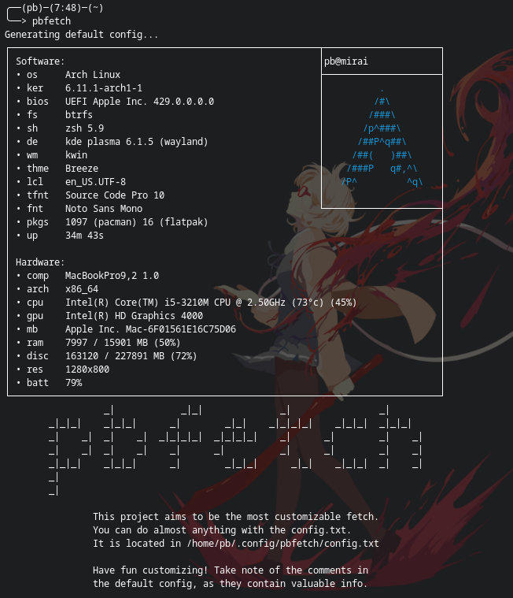
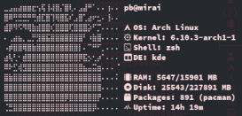
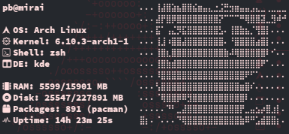
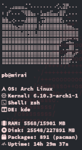
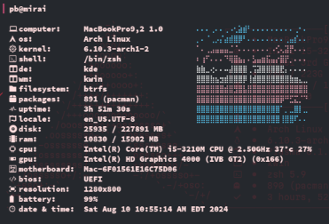

# pbfetch - an unbelievably customizable fetch



**pbfetch** is an incredibly customizable hardware/software fetch utility that
dares to break the mold. Tired of the same old logo sitting on the left side of
your terminal? With **pbfetch**, you have the power to design your system's
fetch output exactly as you envision it. Your terminal, your rules, let your
creativity shine!

## 🌟 Features

- **Unmatched Customization:** Place information wherever you want, however you
  want, with a simple text-based configuration.
- **Flexible Configuration:** Swap out boring logos for dynamic content that you
  control.
- **Simple Syntax:** Utilize easy-to-understand keyword tags to display various
  system stats.

## 🚀 Installation

You have a few options to get started with **pbfetch** depending on your
preferred method:

### Install via the AUR

If you are on an arch based distribution, you can install **pbfetch** using your
favorite AUR helper:

```bash
paru -S pbfetch-git
```

Or if you prefer to install manually:

```bash
git clone https://aur.archlinux.org/pbfetch-git.git
cd pbfetch-git
makepkg -si
```

### Install via Rye

**pbfetch** is bootstrapped by [Rye](https://rye.astral.sh/), a Python toolchain
manager. If you prefer using Rye:

1. Make sure Rye is installed on your system.
2. Clone the **pbfetch** repository and navigate to the project directory:
   ```bash
   git clone https://github.com/pennybelle/pbfetch.git
   cd pbfetch/
   ```
3. Sync the project and run **pbfetch**:
   ```bash
   rye sync
   rye run pbfetch
   ```

## 🛠️ Config

With **pbfetch**, your customization options are practically limitless. The
configuration process is straightforward just edit a simple text file to craft
your ideal output. Using specific keyword tags, you can precisely control what
information is displayed and exactly where it appears on your screen.

The configuration file is the heart of **pbfetch**. It's a plain text file that
allows you to design the fetch output exactly as you envision it. Want to show
your hostname in a specific spot? Simply include the `$host` tag in your
configuration, and **pbfetch** will replace it with your hostname when the
program runs. For example, if your configuration contains `$host`, it will
output something like `user@device`.

You can find an example configuration file [here](src/pbfetch/config/config.txt)
to get started.

The sky's the limit when it comes to creativity! Whether you're aiming for a
traditional system information display or something entirely unique, **pbfetch**
empowers you to bring your vision to life.

### Screenshot Gallery

Check out some amazing examples of what you can create with **pbfetch**:









Creating your own custom configuration is a bit more involved than other fetch
utilities, but the reward is complete control over your terminal’s output. You
are not confined to someone else's design, **pbfetch** puts you in charge!

## 📜 License

**pbfetch** is open-source and licensed under the Apache 2.0 License. This means
you are free to modify, distribute, and use the code as you see fit, just be
sure to provide proper attribution where due.

## ⚠️ Disclaimer

**pbfetch** is currently a work-in-progress (WIP). As of now, it is only
supported on Arch Linux. However, I am eager to expand its compatibility! If
you'd like to contribute or help get **pbfetch** working on your system, please
don't hesitate to reach out. Your feedback and contributions are highly valued.

If you encounter any issues, or if you have suggestions for improvements, please
let me know. I’m here to help and excited to see what you’ll create with
**pbfetch**. Enjoy! 🎉
